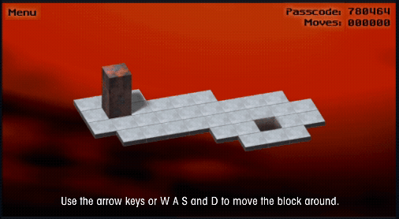

# Bloxorz AI: Search vs. Reinforcement Learning

A from-scratch implementation of the puzzle game **Bloxorz**, used to compare classical graph search against reinforcement learning. Built for Northeastern's CS4100 (Artificial Intelligence).

In Bloxorz, you roll a 1×1×2 block across a tiled grid to land it upright in the goal hole without rolling off the edge. Because the block's orientation is part of the state, the search space is richer than a typical grid maze. Some levels add buttons that toggle bridges on and off.



## What it does

Solves levels four ways and reports comparable metrics for each:

- **BFS** — finds the guaranteed shortest path.
- **A\*** — finds the same optimal path with far fewer states explored, using a Manhattan-distance heuristic.
- **Q-Learning** — a tabular agent that learns a policy from reward feedback, no heuristic needed.
- **DQN** — a Double-DQN with replay buffer and target network that learns over an encoded state vector.

Everything animates in the terminal with ANSI colors: you can watch the search frontier expand and then watch the block roll along the solution. Training produces side-by-side comparisons of path length, states explored, time, and RL success rate.

## Running it

Requires Python 3.10+. Search and Q-Learning need no extra packages; DQN uses PyTorch.

```bash
pip install torch numpy matplotlib   # only needed for DQN + plots

python main.py     # pick a level, watch BFS & A* solve it
python train.py    # train and evaluate Q-Learning and DQN
```

## Project structure

| File | Role |
|------|------|
| `block.py` / `level.py` / `levels.py` | Game model: movement, orientation, win checks, button & bridge mechanics |
| `search.py` | BFS and A\* with stats |
| `env.py` / `q_learning.py` / `dqn.py` | RL environment and agents |
| `evaluate.py` | Metrics and comparison tables |
| `visualizer.py` / `main.py` | Terminal animation and interactive menu |
